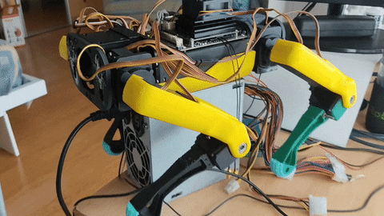

# Spot Micro quadruped robot

- [Overview](#overview)
- [Mechanics](docs/mechanics.md)
- [Hardware](docs/hardware.md)
- [Software](docs/software.md)
- [Execution](docs/execution.md)
- [Future Work](https://github.com/eborghi10/spot_quadruped_ros/projects/1)
- [External Links](#external-links)

## Overview

This project is a modification for the SpotMicroAI quadruped project, a 4-legged open source robot.
There are a few modification but the baseline quadruped is the SpotMicroAI.
The most important key points of this design:

* It runs with ROS
* It won't use super expensive motors but it will try to be energetically efficient

## External links

Spot Micro AI community: <https://gitlab.com/custom_robots/spotmicroai>
